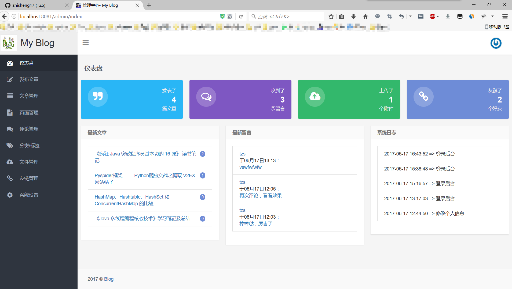
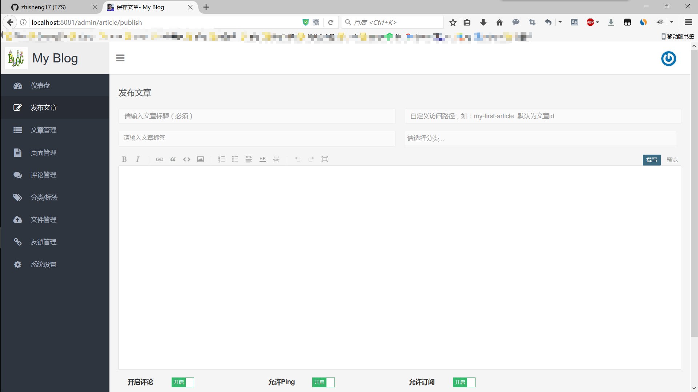
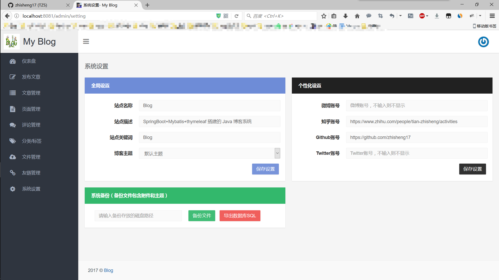

## Blog
 博客首页：
 

 归档：
 

 友链：
 
 
 关于：
 
 
 搜索：
 
 
 **后台管理**
 
 管理登录：
 
 
 管理首页：
 
 
 发布文章：
 
 
 文章管理：
 
 
 页面管理：
 
 
 分类标签：
 
 
 文件管理：
 
  
 友链管理：
 
   
 系统设置：
 
 
## 开源协议

[MIT](./LICENSE)

## 感谢

[ZHENFENG13](https://github.com/ZHENFENG13)
[otale](https://github.com/otale)

##部署安装
1. 新建数据库tale
进入mysql  运行source sql文件来恢复库表

2. git下来后在根目录 mvn install
nohub  mvn spring-boot:run

3. http://ip:8081/ 访问前台
后面加admin/login访问后台 默认账号admin/123456  如果登录不了请修改数据库中t_user数据即可 密码是md5加密
