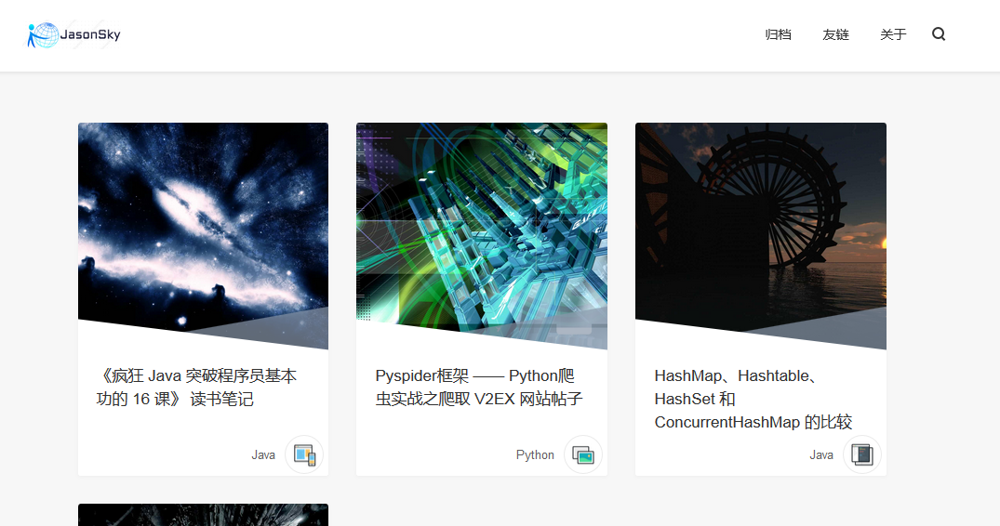
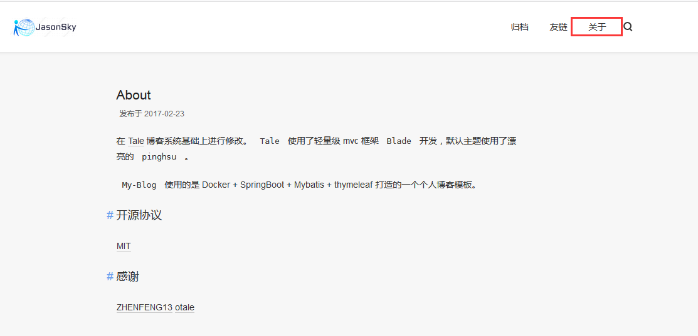
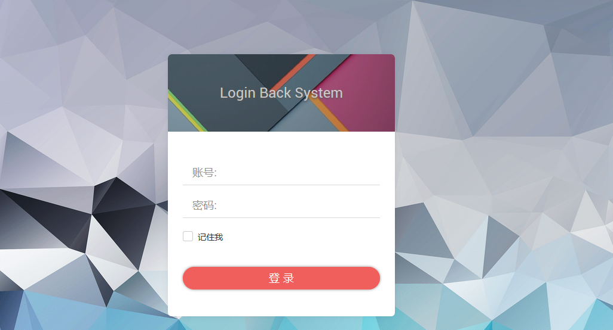
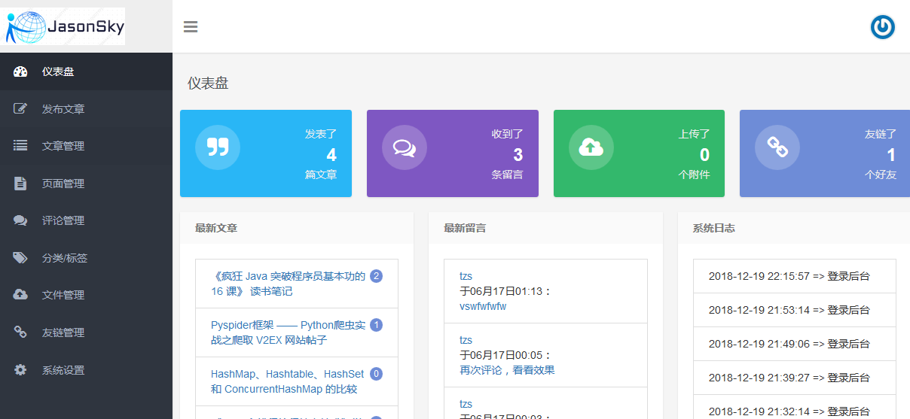

## Blog
 博客首页：
 

 关于：
 
 
 **后台管理**
 
 管理登录：
 
 
 管理首页：
 
 
## 开源协议

[MIT](./LICENSE)

## 感谢

[ZHENFENG13](https://github.com/ZHENFENG13)
[otale](https://github.com/otale)

##部署安装
1. 新建数据库tale
进入mysql  运行source sql文件来恢复库表

2. git下来后在根目录 mvn install
nohub  mvn spring-boot:run

3. http://ip:8081/ 访问前台
后面加admin/login访问后台 默认账号admin/123456  如果登录不了请修改数据库中t_user数据即可 密码是md5加密

需要通过域名访问时
配置Nginx{proxy_cookie_path 以免session取不到的问题}
server {
        listen 80;
        server_name blog.jasonsky.com.cn;
        location / {
                proxy_pass http://localhost:8080/blog/;
                proxy_cookie_path  /blog      /;
                proxy_set_header Host $host;
                proxy_set_header X-Real-IP $remote_addr;
                proxy_set_header X-Forwarded-For $proxy_add_x_forwarded_for;
        }
    }

